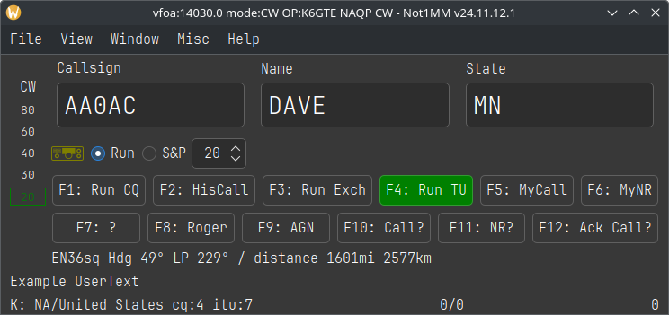

= Creating your own Call History files

You can use *adif2callhistory* at
_https://github.com/mbridak/adif2callhistory_ to generate your own call
history file from your ADIF files. An example file excerpt looks like:

....
!!Order!!,Call,Name,State,UserText,
#
# 0-This is helping file, LOG what is sent.
# 1-Last Edit,2024-08-18
# 2-Send any corrections direct to ve2fk@arrl.net
# 3-Updated from the log of Marsh/KA5M
# 4-Thanks Bjorn SM7IUN for his help.
# 5-Thanks
# NAQPCW
# NAQPRTTY
# NAQPSSB
# SPRINTCW
# SPRINTLADD
# SPRINTNS
# SPRINTRTTY
# SPRINTSSB
AA0AC,DAVE,MN,Example UserText
AA0AI,STEVE,IA,
AA0AO,TOM,MN,
AA0AW,DOUG,MN,
AA0BA,,TN,
AA0BR,,CO,
AA0BW,,MO,
....

The first line is the field definition header. The lines starting with a
‘++#++‘ are comments. Some of the comments are other contests that this
file also works with. This is followed by the actual data. If the
matched call has ‘UserText‘ information, that user text is populated to
the bottom left of the logging window.

So if one were to go to *FILE ++>>++ LOAD CALL HISTORY FILE* and choose
a downloaded call history file for NAQP and typed in the call AA0AC
while operating in the NAQP, after pressing space, one would see:

Where the Name and State would auto-populate and the UserText info
apprears in the bottom left.

