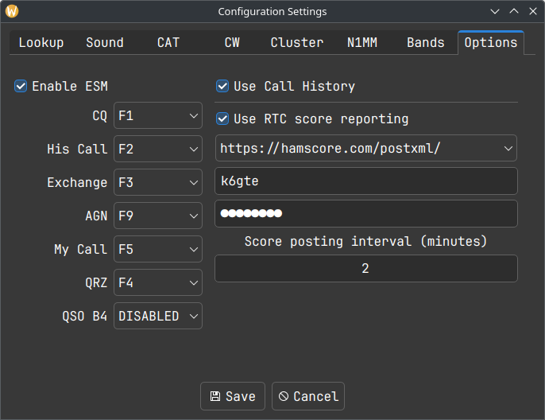
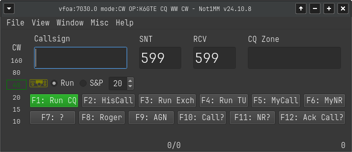
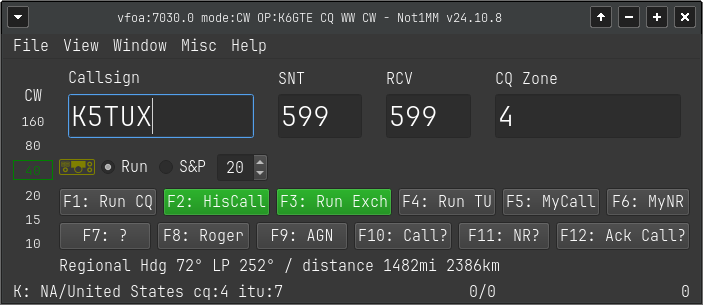
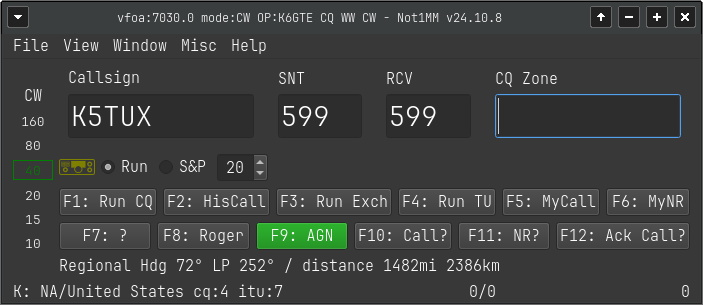
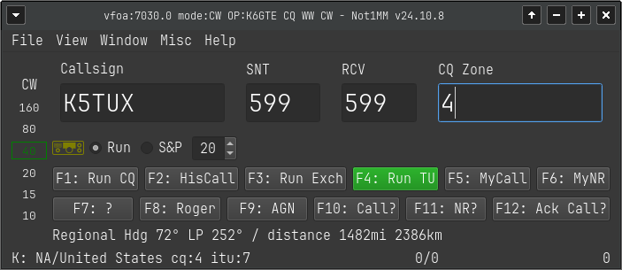
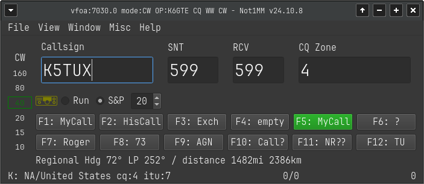
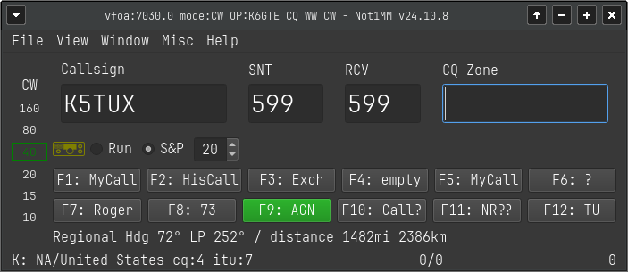
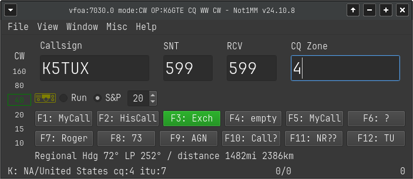

= ESM

I caved and started working on ESM or Enter Sends Message. To test it
out you can go to *FILE ++>>++ Configuration Settings*

Check the mark to Enable ESM and tell it which function keys do what.
The keys will need to have the same function in both Run and S&P modes.
The function keys will highlight green depending on the state of the
input fields. The green keys will be sent if you press the Enter key.
You should use the Space bar to move to another field.

The contact will be automatically logged once all the needed info is
collected and the QRZ (for Run) or Exchange (for S&P) is sent.

== Run States

=== CQ

=== Call Entered Send His Call and the Exchange

=== Empty Exchange Field Send AGN Till You Get It

=== Exchange Field Filled, Send TU QRZ and Logs it

== S&P States

=== With His Call Entered, Send Your Call

=== If No Exchange Entered Send AGN

=== With Exchange Entered, Send Your Exchange and Log it

