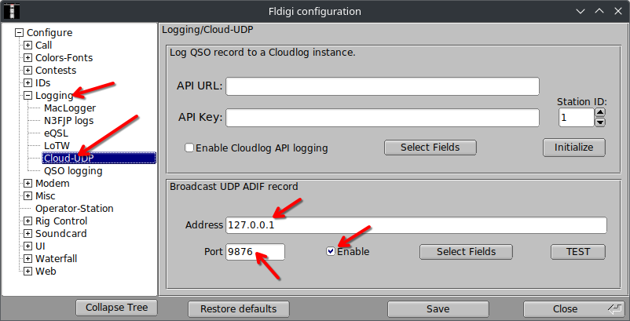

= Logging Digital Contacts

Not1MM listens for WSJT-X UDP traffic on the Multicast address
224.0.0.1:2237. This should work by default with Not1MM. That’s good
because I’m lazy. +
Not1MM watches for fldigi QSOs by monitoring UDP traffic on
127.0.0.1:9876.

The F1–F12 function keys are sent to fldigi via XMLRPC. Fldigi is placed
into TX mode, the message is sent, and a latexmath:[\wedge]r is appended
to place it back into RX mode.

Unlike WSJT, fldigi needs configuration of some settings. The XMLRPC
interface needs to be active. In fldigi’s config dialog, go to *CONTESTS
++>>++ General ++>>++ CONTEST* and select Generic Contest. Make sure the
Text Capture Order field says CALL EXCHANGE.
