== Not1MM

The world’s number 1 unfinished contest logger. ^++*++According to my
daughter Corinna.^

Not1MM’s interface is a blatant rip-off of N1MM. It is NOT N1MM and any
problem you have with this software should in no way reflect on their
software.

=== Not1MM. What is it?

Not1MM attempts to be a usable ham/amateur radio contest logger. It’s
written in Python 3.10{plus} and uses Qt6 framework for the graphical
interface and SQLite for the database.

=== The Why

*Currently, this exists for my own personal enjoyment*. I recently
retired after 35{plus} years working for ’The Phone Company’, GTE →
Verizon → Frontier. And being a Gentleman of Leisure, I needed something
to do in my free time. I am a casual contester and could not find any
contesting software for Linux that I wanted to use. There is *Tucnak*,
available at _HTTP://tucnak.nagano.cz/_ which is very robust and mature.
It just wasn’t for me.

=== Target Environment

The primary target for this application is Linux. It may be able to run
on other platforms, BSD and Windows. But I don’t have a way, or desire,
to directly support them. I’ve recently purchased an M4 Mac Mini, So
I’ll probably put more effort into that platform as well.

=== Current State, or Code Maturity

Not1MM is, at times, fairly stable. Recently, it would seem that I’m
desperately trying to change that. The current focus of development is
adding support for Multi Multi contest operations. It is something that
I have no practical experience in. So you can expect the same quality of
code fit and finish.

=== Known Issues

* Hamlib before 4.6.3 had a problem with sending CW and changing/reading
the keying speed.
* wfview before version 2.2 has issues with frequency reporting and CW
sending.

== List of Should-Be-Working Contests

3

* General Logging
* 10 10 Fall CW
* 10 10 Spring CW
* 10 10 Summer Phone
* 10 10 Winter Phone
* ARI 40 80
* ARI DX
* ARRL 10M
* ARRL 160M
* ARRL DX CW, SSB
* ARRL Field Day
* ARRL RTTY Roundup
* ARRL Sweepstakes
* ARRL VHF
* CQ 160
* CQ WPX
* CQ World Wide
* CWOps CWT, CWO
* DARC Xmas
* DARC VHF
* EA Majistad CW
* EA Majistad SSB
* EA RTTY
* ES FIELD DAY HF
* ES OPEN HF
* Estonian LL Cup
* Helvetia
* IARU Field day
* IARU HF
* ICWC MST
* Japan International DX
* K1USN Slow Speed Test
* Labre RS Digi
* LZ DX
* NAQP
* Phone Weekly Test
* RAEM
* RAC Canada Day
* RandomGram
* REF CW, SSB
* RSGB 80M CC
* SAC CW, SSB
* SPDX
* Stew Perry Top band
* UK/EI DX
* Weekly RTTY
* Work All Germany
* Winter Field Day

=== Other not so Supported Contests

Of note, state QSO parties. I haven’t worked any yet. And no one has
submitted a PR adding one... So there you go. In the near future I’ll
probably add California, guess where I live, and the 4 states QSO party.

== Installation

This section will hopefully get you started with installing Not1MM.

=== Prerequisites

Not1MM requires:

* Python 3.10{plus}
* PyQt6
* libportaudio2
* libxcb-cursor0 (maybe... Depends on the distro)
* libxslt-devel (maybe... Depends on the distro)
* libxml2-devel (maybe... Depends on the distro)

You should install these through your distribution’s package manager
before continuing.

=== The Easy and Fast way to install or run the latest version

Step 1. Visit https://docs.astral.sh/uv/ and install uv.

In short you run this in your terminal:

....
    •curl -LsSf https://astral.sh/uv/install.sh | sh
....

Step 2. Tell it to run not1mm:

....
    •uvx not1mm@latest
....

or install it:

....
    •uv tool install not1mm@latest
....

That’s it... It will go out, fetch the latest version of not1mm, setup a
python virtual environment, get all the needed python libraries, cache
everything and run not1mm. The first time takes a minute, but each time
after, it’s lightning quick and it will automatically check for updates
and run the latest version.

But wait... There’s more. If your distro is old and you’re stuck with an
older version of python... Say 3.10. And you want to see what all the
cool kids are using. But you don’t want to corrupt your broke ol’ system
by downloading the newest Python version. No problem. You can tell uv to
run not1mm with any version of Python you’d like. Let’s say 3.14.

....
    •uvx --python 3.14 not1mm@latest
....

It’ll download Python 3.14 into your virtual environment and run not1mm.
Let’s say I was an idiot and pushed a new version and did’t fully test
it. This happens a-lot... We test in production. Or lets say you just
want to see the pain that was back in 2023. No problem. Just tell it
which version of not1mm you’d like to run.

....
    •uvx --python 3.10 not1mm==23.5.19
....

Pow! Enjoy the pain...

== After the Install

You can now open a new terminal and type ‘not1mm‘. On it’s first run, it
may or may not install a lovely non AI generated icon, which you can
later click on to launch the application.

=== You May or May Not Get a Warning Message Like

....
WARNING: The script not1mm is installed in '/home/mbridak/.local/bin',
which is not on PATH. Consider adding this directory to PATH or,
if you prefer to suppress this warning, use --no-warn-script-location.
....

If you do, log out and back in or reboot.

=== Or this Fan Favorite

....
Warning: Ignoring XDG\_SESSION\_TYPE=wayland on Gnome.
Use QT\_QPA\_PLATFORM=wayland to run on Wayland anyway.
qt.qpa.plugin: Could not load the Qt platform plugin "xcb"
even though it was found. This application failed to start
because no Qt platform plugin could be initialized.
Reinstalling the application may fix this problem.
....

You can use your package manager to load *libxcb-cursor0*. +
If that is not an option, you can export an environment variable and
launch the app like this:

....
mbridak@vm:~$ export QT_QPA_PLATFORM=wayland; not1mm
....

For a more permanent solution, you can place the line:

....
export QT_QPA_PLATFORM=wayland
....

in your home directories .bashrc file. Then after logging out and back
in you should be able to launch it normally.

=== Update Your CTY and SCP Files

Before operating in a contest, you might want to update the CTY and SCP
files. You can do this by choosing *FILE ++>>++ Update CTY* and *FILE
++>>++ Update MASTER.SCP*

== Various File Locations

=== Data Files

If your system has an ‘XDG++_++DATA++_++HOME‘ environment variable set,
the database and CW macro files can be found there. Otherwise they will
be found at ‘yourhome/.local/share/not1mm‘

=== Configuration Files

Configuration file(s) can be found at the location defined by

....
XDG_CONFIG_HOME
....

Otherwise they will be found at

....
yourhome/.config/not1mm
....

== The Database

=== Why

The database holds... wait for it... data... I know, shocker right? A
database can hold one or many contest logs. It also holds the station
information, everything shown in the Station Settings dialog. You can
have one database for the rest of your life. Filled with hundreds of
contests you’ve logged. Or, you can create a new database to hold just
one contest. You do you Boo.

=== The First One is Free

On initial launch, a database is created called ‘ham.db‘. This and all
future databases are located in the data directory mentioned above.

=== Why Limit Yourself?

You can create a new database by selecting *File ++>>++ New Database*
from the main window, and give it a snazzy name. Why limit yourself?
Hell, create one every day for all I care. You can manage your own
digital disaster.

=== Revisiting an Old Friend

You can select a previously created database by selecting: *File ++>>++
Open Database*.

== Station Settings Dialog

After initial run of the program or when creating a new database, you
will need to fill out the Station Settings dialog that will pop up.

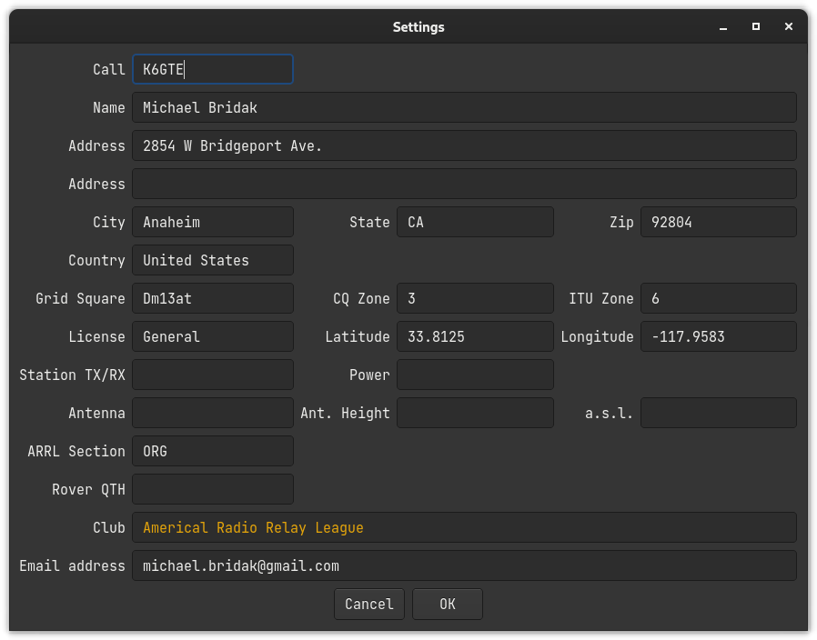

You can fill it out if you want to. You can leave our friends behind
’Cause your friends don’t fill, and if they don’t fill. Well, they’re no
friends of mine.

You can fill. You can fill. Everyone look at your keys. _You had to be
around in the 80’s_

=== Changing Station Information

Station information can be changed any time by going to +
*File ++>>++ Station Settings* and editing the information.

== Selecting a Contest

=== Selecting a New Contest

Select *File ++>>++ New Contest*

image:pic/new_contest.png[image,scaledwidth=50.0%]

=== Selecting an Existing Contest as the Current Contest

Select *File ++>>++ Open Contest*

image:pic/select_contest.png[image,scaledwidth=50.0%]

=== Editing Existing Contest Parameters

Edit the parameters of a previously defined contest by selecting it as
the current contest. Then select *File ++>>++ Edit Current Contest*.
Click ‘OK‘ to save the new values and reload the contest. ‘Cancel‘ to
keep the existing parameters.

== Configuration Settings

To setup CAT control, CW keyer, and callsign lookups select *File ++>>++
Configuration Settings*.

The tabs for groups and N1MM are disabled and are for future expansion.

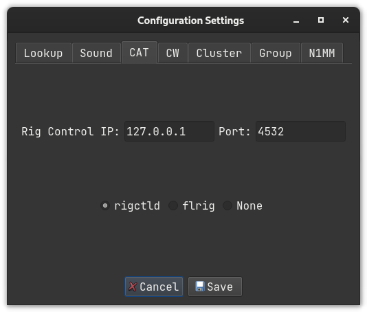

=== Callsign Lookup

Two services are supported: QRZ and HamQTH. Username and password are
required so enter that information here.

=== Soundcard

Choose the sound output device for the voice keyer.

=== CAT Control

Under the ‘CAT‘ tab, you can choose one of the following:

* ‘rigctld‘ normally with an IP of ‘127.0.0.1‘ and a port of ‘4532‘
* ‘flrig‘ normally with an IP of ‘127.0.0.1‘ and a port of ‘12345‘
* ‘None‘ is always an option (but is it really?).

A small transceiver icon changes color to indicate the CAT status.
Green: Connected; Red: Not connected; Grey: Neither.

=== CW Keyer Interface

Under the ‘CW‘ tab, there are three options:

* ‘cwdaemon‘ normally uses IP ‘127.0.0.1‘ and port ‘6789‘
* ‘pywinkeyer‘ normally uses IP ‘127.0.0.1‘ and port ‘8000‘
* ‘CAT‘ can be used if your radio supports it. Morse characters are sent
via ‘rigctld‘.

=== Cluster

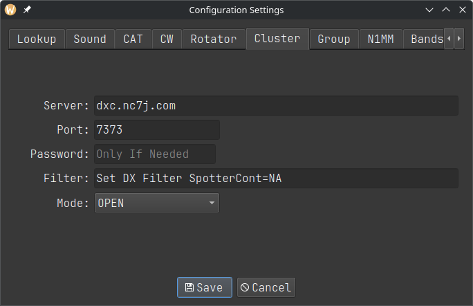

Under the ‘Cluster‘ tab you can change the default AR Cluster server,
port, and filter settings used for the bandmap window.

=== N1MM Packets

Work has started on N1MM UDP packets. So far just RadioInfo,
contactinfo, contactreplace and contactdelete.

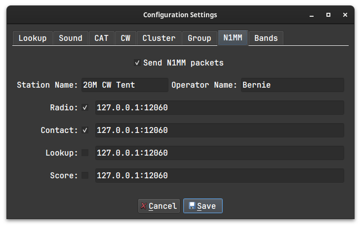

When entering IP and corresponding Port, connect them with a colon ’:’
as shown above. You can enter multiple pairs on the same line by
separating them with a space ’ ’.

=== Bands

You can define which bands appear in the main window. Those with
checkmarks will appear. Those without will not.

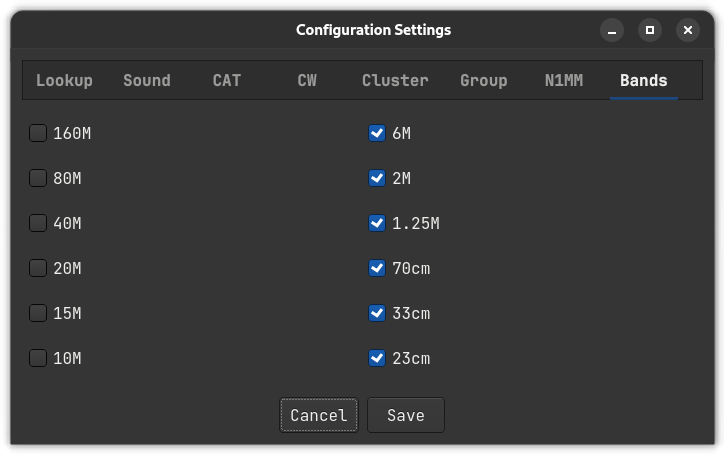

=== Options

A variety of features can be enabled in the Options tab:

* Use Enter Sends Message (ESM) and configure its function keys.
* Allow the program to access Call History info.
* Periodically send XML score to an online scoreboard.
* Clear the input fields in S&P mode when the VFO frequency changes.

image:pic/configuration_options.png[image,scaledwidth=90.0%]

Three real-time scoreboards are supported:

* Real Time Contest Server at hamscore.com
* Contest Online ScoreBoard at contestonlinescore.com
* Live Contest Score at contest.run

== Logging Digital Contacts

Not1MM listens for WSJT-X UDP traffic on the Multicast address
224.0.0.1:2237. This should work by default with Not1MM. That’s good
because I’m lazy. +
Not1MM watches for fldigi QSOs by monitoring UDP traffic on
127.0.0.1:9876.

image:pic/fldigi_adif_udp.png[image,scaledwidth=90.0%]

The F1–F12 function keys are sent to fldigi via XMLRPC. Fldigi is placed
into TX mode, the message is sent, and a latexmath:[\wedge]r is appended
to place it back into RX mode.

Unlike WSJT, fldigi needs configuration of some settings. The XMLRPC
interface needs to be active. In fldigi’s config dialog, go to *CONTESTS
++>>++ General ++>>++ CONTEST* and select Generic Contest. Make sure the
Text Capture Order field says CALL EXCHANGE.

== Operating Multi-Multi

Work is underway on Multi-Multi contest operations. There is a companion
project *renfield* +
_https://github.com/mbridak/renfield_ that will be needed for this. The
idea is to have a separate slave server running, preferably on another
computer that’s on the same network as the contesting PCs. This server
will handle all the database CRUD operations. It will assign serial
numbers, check for duplivate contacts, and generate a Cabrillo file.

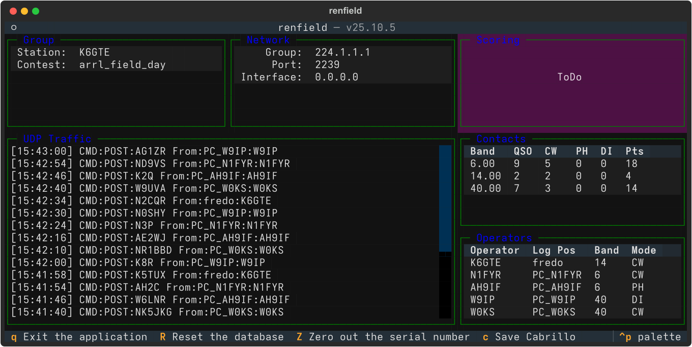

This is a very lightweight terminal application that can be easily
hosted on a Raspberry Pi or similar device. In a pinch it can be run
alongside Not1MM on one of the contesting machines but use caution. You
could even use this while operating alone as an automated backup. A copy
of the log would be available in the event of a logging computer
failure.

=== Network Settings for Multi-Multi

In the configuration dialog under the group tab, select Connect to
server.

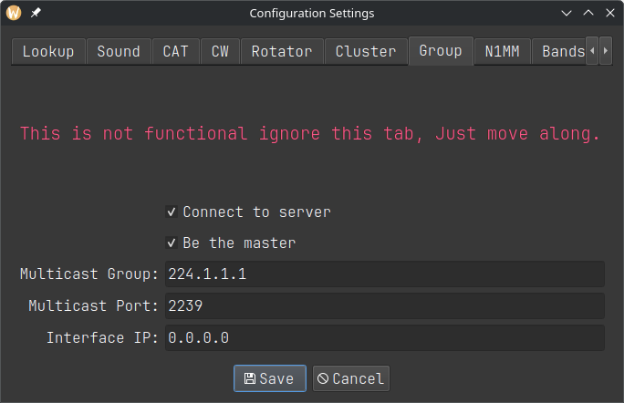

One computer needs to be the master station. The master station will
tell the renfield server what contest is being run.

=== Contest Settings for Multi-Multi

In Contest Settings, if the Operator is set to "MULTI-OP" and the
Transmitter category is not "ONE" or "SWL", Not1MM will ask the renfield
server for serial numbers and dupe checks.

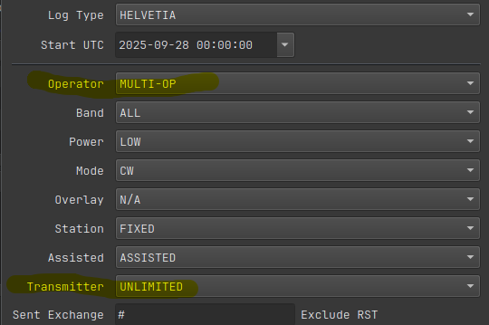

== Sending CW

=== Sending CW Macros

Predefined CW messages can be sent with function keys F1–F12. See the
following section on Editing Macro Keys.

=== Auto CQ

Pressing ‘SHIFT-F1‘ activates the Auto CQ mode. The program is placed in
the Run state and the F1 macro is sent then resent after the Auto CQ
delay interval. A visual indicator appears to the upper left of the F1
macro key to alert that Auto CQ is active. A small progress bar
indicates when F1 will fire next.

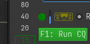

==== Setting the delay

The Auto CQ delay interval can be changed in the ‘Options‘ tab of the
Configuration settings. This value is the sum of the F1 macro duration
_plus_ the desired pause time in which stations can respond. If the
program is in S&P mode when Auto CQ is enabled, it will automatically
switch to RUN mode.

=== Sending CW Free Form

Freeform text is sent by pressing *CTRL-SHIFT-K*. An entry field appears
at the bottom of the window for typing from the keyboard terminal. The
text is sent by either pressing *CTRL-SHIFT-K* or using the Enter key to
close the entry field.

== Editing Macro Keys

To edit the macro keys, choose *File ++>>++ Edit Macros*. This will open
the system default text editor and display the current active macros.
The current operating mode (CW, SSB or RTTY) and contest will
automatically select the corresponding macro file. Each contest and mode
has its own unique copy of the macros – these are not global settings.
When finished editing, save the file and close the editor.

Alternatively, macro files can be directly edited outside the not1mm
program. On Linux, individual contest directories are located in
‘.local/share/not1mm/‘. Refer to the *Data Files* section above.

After editing and saving the macro file, any changes are enabled by
toggling between the ‘Run‘ and ‘S&P‘ states.

=== Macro Substitutions

The macro instruction set is shown below.

[cols="^,<",options="header",]
|===
|*Macro* |*Substitution*
|++{++MYCALL} |Send my station callsign.

|++{++HISCALL} |Send the callsign of the other station.

|++{++SNT} |Send 5NN (cw) or 599 (ssb)

|++{++SENTNR} |Send the SentNR field.

|++{++EXCH} |Send the Exchange field; contest must be defined.

|++{++PREVNR} |Send the previous serial number.

|++{++OTHER1} |Send the SentNR/Name field without altering it.

|++{++OTHER2} |Send the Comment field without altering it.

|++{++LOGIT} |Log the contact after macro pressed.

|++{++TX} |Switch to transmit mode (PTT ON) - NOTE: the ‘Sends‘ macros
will toggle PTT ON/OFF

|++{++RX} |Switch to receive mode (PTT OFF).

|++{++TX/RX} |Toggle between transmit/receive (PTT) mode.

|++{++MARK} |Highlight the current call in the band map.

|++{++SPOT} |Spot the current call to the cluster.

|++{++RUN} |Change to Run mode.

|++{++SANDP} |Change to S&P mode.

|++{++WIPE} |Clear all the input fields.

|++#++ |Sends serial number.

|++{++VOICE1} - ++{++VOICE10} |Uses ‘rigctld‘ to send voice macros
stored in the radio.

| RI: |Send Rig specific codes. See Macro control of radio functions.

| latexmath:[\wedge]M |in a RTTY macro will be replaced with a newline
character.
|===

=== Macro Use with Voice

*VOICE1–VOICE10* +
If you use rigctld and your radio supports it, you can use the macros
VOICE1, VOICE2, etc to send the recorded audio messages stored in the
radio.

==== Voice macro .wav files

The macros used with voice can also linked to .wav files. Specify the
filename, but exclude the .wav extension. The filename must be lowercase
and enclosed in brackets. For example ‘++[++cq++]++‘ will play ‘cq.wav‘,
‘++[++again++]++‘ will play ‘again.wav‘. The .wav files are stored in
the data directory. See *Various data file locations* above for the
location of these data files. For me, the macro ‘++[++cq++]++‘ will play

....
/home/mbridak/.local/share/not1mm/K6GTE/cq.wav
....

*The default .wav files are not the ones you will want to use. They
sound like an idiot.* Use a program like Audacity or similar to record
new .wav files in your own voice.

NATO phonetic .wav files are also provided for each letter and number.
Their use can be illustrated with an example from the CQWW SSB Contest
operating from Zone 3. The callsign K5TUX is entered and the following
macro key is activated: ‘HISCALL SNT SENTNR‘. The program then sends
this sequence of audio phonetics: KILO FIVE TANGO UNIFORM X-RAY FIVE
NINE NINE THREE.

==== Macro control of radio functions

Macros can also be used to send CAT/CI-V control codes to the radio. To
make use of this feature, start the command with the letters "RI" and a
colon, followed by the desired command. If the command is ASCII text
(for example, for Yaesu radios), just enter the text after "RI:". For
binary codes, enter hexadecimal values separated by spaces.

For example, to enable the auto-notch filter on a Yaesu FT-710, the
command would be "RI:BC01;". To do the same on an Icom 7300, the command
would be something like "RI:FE FE 94 E0 16 41 01 FD". Refer to the
operating manual or online sources for the correct command syntax. Note
that CAT/CI-V command macros are only available when either FLRig or
rigctld (HamLib) are being used for transceiver control.

== cty.dat and QRZ for Distance and Bearing

When a callsign is entered, a lookup is done in the cty.dat file to
identify the country of origin, geographic center, CQ zone, and ITU
region. Great circle calculations are then done to determine the heading
and distance from the home grid square to the geographic center of the
DX station. This information is displayed at the bottom left.

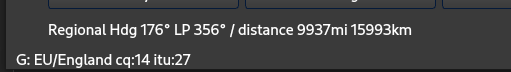

Next, a request is made to qrz.com for the grid square of the callsign.
If there is a response, more accurate distance and bearing numbers are
displayed. The ‘Regional‘ text is replaced with the station’s specific
6-digit grid square as shown below.

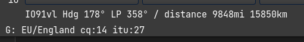

== Other Uses for the Callsign Field

*The SPACE bar must be pressed to enable any of the following
functions.*

=== Frequency

*Frequency* Enter a frequency in kHz. This changes the active logging
band. If CAT control is enabled, the specified frequency will change the
transceiver VFO.

=== Modes

*CW, SSB, RTTY* Sets the mode being logged. If CAT control is enabled,
the mode changes on the radio.

=== Change Operator

*OPON* Specify the operator currently logging. +
 +
*Important: Press the SPACE bar after making any of the above entries.*

== The Windows

=== The Main Window

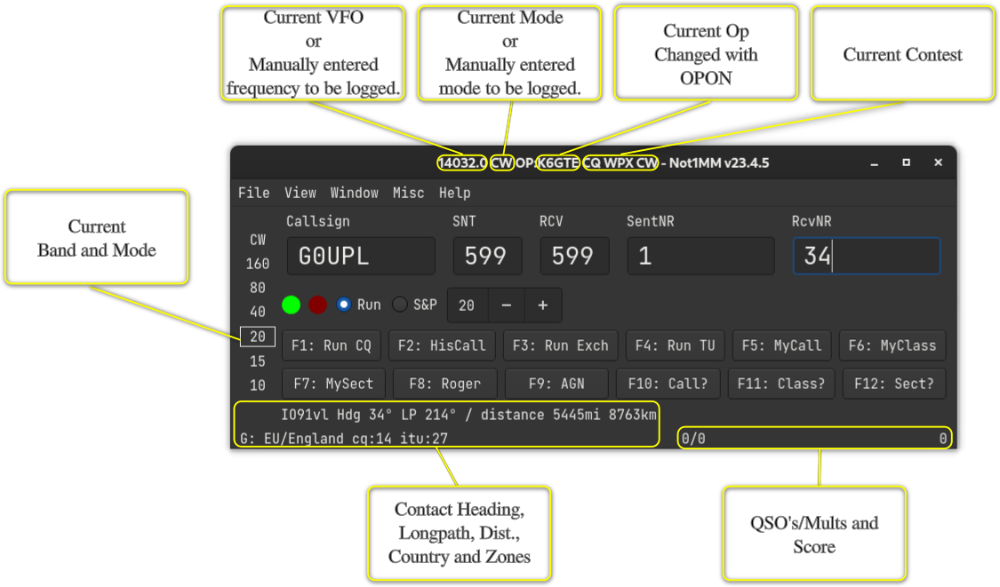

==== Keyboard Commands

[cols="^,<",options="header",]
|===
|*Key* |*Result*
|Esc |Stop the cwdaemon from sending Morse characters.

|PgUp |Increase the CW sending speed.

|PgDown |Decrease the CW sending speed.

|Arrow-Up |Jump to the next spot above the current VFO cursor in the
bandmap window (CAT Required).

|Arrow-Down |Jump to the next spot below the current VFO cursor in the
bandmap window (CAT Required).

|TAB |Move cursor to the right one field.

|Shift-Tab |Move cursor left One field.

|SPACE |When in the callsign field, move the input to the next field in
the exchange.

|Enter |Submit entered data to the log, unless ESM is enabled.

|F1-F12 |Send (CW/RTTY/Voice) macros.

|CTRL-S |Spot Callsign to the cluster.

|CTRL-M |Highlight Callsign in the bandmap window.

|CTRL-G |Tune to a spot matching partial text in the callsign entry
field (CAT Required).

|CTRL-SHIFT-K |Open CW text input field.

|CTRL-= |Log the contact without sending the ESM macros.

|CTRL-W |Clear the input fields of any text.

|ALT-B |Toggle the bandmap window.

|ALT-C |Toggle the Check Partial window.

|ALT-L |Toggle the QSO Log window.

|ALT-R |Toggle the Rate window.

|ALT-S |Toggle the Statistics window.

|ALT-V |Toggle the VFO window.
|===

=== The Log Window

*Window ++>>++ Log Window*

The Log Window gets updated automatically when a contact is entered. The
top half is a chronological list of all contacts.

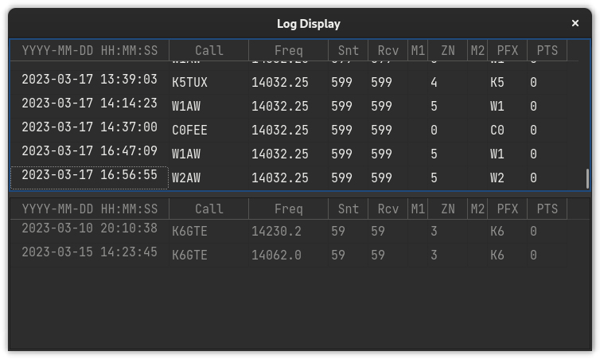

The bottom half of the Log Window displays logged contacts sorted by
complete or partial matches to characters in the call entry field. The
columns displayed in the log window depend on the current active
contest.

==== Editing a Contact

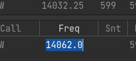

Double-click a cell in the log window to edit its contents.
Right-clicking on a cell brings up the edit dialog.

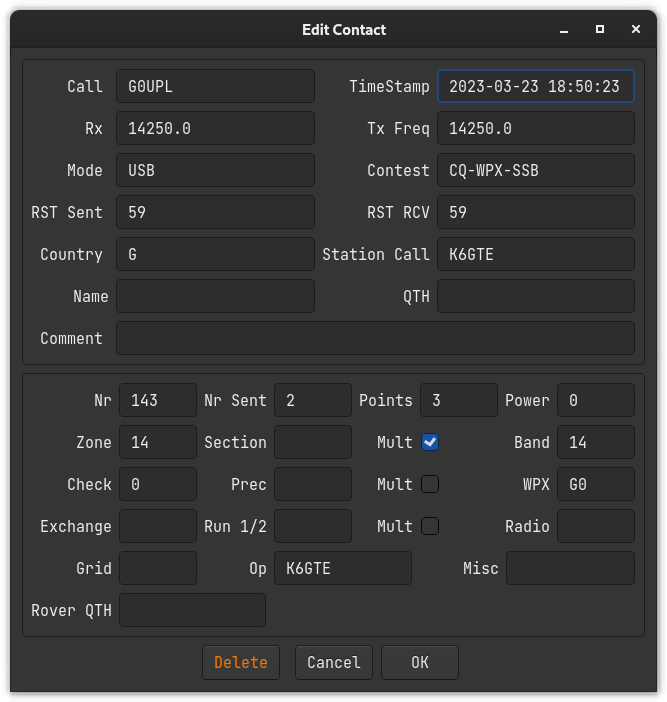

You cannot directly edit the multiplier status of a contact. See the
next section on recalculating multipliers. When editing a logged
callsign, it’s a good idea to check if other data such as the WPX field
are still valid.

=== The Bandmap Window

*Window ++>>++ Bandmap*‘

The bandmap displays spots drawn from the Cluster node specified in the
Configuration Settings. Enter your callsign and press the Connect
button. When CAT is enabled, the bandmap will track with the VFO. This
is still a work in progress.

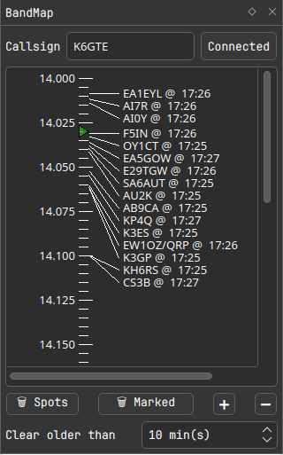

The VFO frequency is indicated with a small green triangle above the
tick marks. A vertical blue bar displays the receive filter bandwidth if
available via CAT.

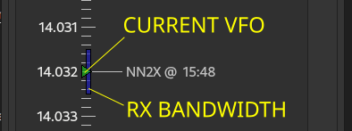

Clicking on a spot sets the VFO and populates the callsign field.
Previously worked callsigns are displayed in red. Callsigns marked with
CTRL-M are highlighted in yellow. A small icon after the callsign
indicates the mode as follows: +
Primary Modes:

* latexmath:[\bigcirc] CW
* latexmath:[\bigodot] FT++*++
* latexmath:[\circledcirc] RTTY
* latexmath:[\bigwedge] Beacon
* @ Everything else

Secondary Modes:

* POTA
* SOTA

The icon is followed by the UTC time of the spot. The screenshot below
shows CW and FT8 spots on the 20m band.

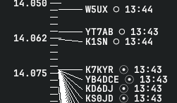

=== The Check Partial Window

*Window ++>>++ Check Partial Window*

As a callsign is entered, the Check Window displays potential matches
from the MASTER.SCP file, the local log, and recent telnet cluster
spots. The MASTER.SCP column shows candidates with 3 or more matching
characters indexed from the start of the callsign string. The local log
and telnet columns match character strings of any length. Clicking on
any of these candidate callsigns will automatically populate the
callsign field.

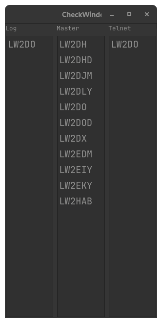

=== The Rate Window

*Window ++>>++ Rate Window*

This window contains QSO rates and counts.

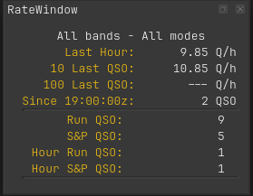

=== The DXCC window

*Window ++>>++ DXCC*

This window displays a table of worked DXCC entities arranged by band.
When optional automatic scrolling is enabled, entering a callsign will
scroll to the corresponding DXCC entity prefix.

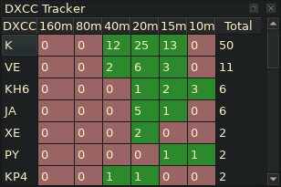

=== The Zone window

*Window ++>>++ Zone*

This window functions the same way as the DXCC window, but for CQ or ITU
zones. When automatic scrolling is enabled, check the appropriate radio
button to select CQ or ITU zones as determined by the DX contest
requirements.

=== The Rotator Window (Work In Progress)

*Window ++>>++ Rotator*

The Rotator window is a work in progress. The Rotator window relies on
the functionality of the rotctld daemon. It connects to rotctld on
address 127.0.0.1 and port 4533. You can change this if needed in the
configuration dialog under the rotator tab. If started and there is no
connection, you will see this:

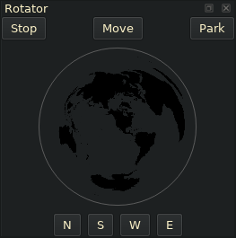

Once there is a connection to rotctld, the current azimuth of the
antenna is obtained and you will see a direction needle apear:

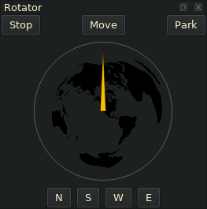

Once a call is entered and the bearing to contact is calculated you will
see a needle appear:

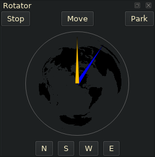

At this time you can click on the ’Move’ button to point your antenna at
the contact. A list of other buttons follows below.

*Move*: Rotates the antenna at the target.

*Stop*: Stops the current movement.

*Park*: Parks the antenna.

*N,S,W,E*: Points the antenna to one of the 4 cardinal directions.

You can also move the rotator by clicking in the globe where you want
the antenna to point.

=== The Remote VFO Window

When operating a remote station, the transceiver VFO can be controlled
using inexpensive hardware in tandem with the Remote VFO window. A
description of the hardware can be found at the following link:

....
    https://github.com/mbridak/not1mm/blob/master/usb\_vfo\_knob/vfo.md
....

Communicate with it using the VFO Window: *Window ++>>++ VFO*

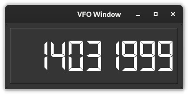

== Cabrillo

Click on *File ++>>++ Generate Cabrillo*

The file will be placed in your home directory. The name will be in the
format of:

....
`StationCall`_`ContestName`_`CurrentDate`_`CurrentTime`.log
....

So for me, it would look like:

....
K6GTE\_CANADA-DAY\_2023-09-04\_07-47-05.log
....

== ADIF

*File ++>>++ Generate ADIF*

Boom... ADIF

....
`StationCall`_`ContestName`_`Date`_`Time`.adi
....

== Recalulate Mults

The program automatically updates the score as each new entry is logged.
There may be a situation where a station has been logged incorrectly.
This QSO can be easily edited as described above, but this may add or
remove a multiplier. To remedy this and correct the score, a Recalculate
Mults function is located in the Misc menu. The Cabrillo/ADIF files must
be regenerated.

== ESM

I caved and started working on ESM or Enter Sends Message. To test it
out you can go to *FILE ++>>++ Configuration Settings*

image:pic/configuration_options.png[image,scaledwidth=90.0%]

Check the mark to Enable ESM and tell it which function keys do what.
The keys will need to have the same function in both Run and S&P modes.
The function keys will highlight green depending on the state of the
input fields. The green keys will be sent if you press the Enter key.
You should use the Space bar to move to another field.

The contact will be automatically logged once all the needed info is
collected and the QRZ (for Run) or Exchange (for S&P) is sent.

=== Run States

==== CQ

image:pic/esm_cq.png[image,scaledwidth=75.0%]

==== Call Entered Send His Call and the Exchange

image:pic/esm_withcall.png[image,scaledwidth=75.0%]

==== Empty Exchange Field Send AGN Till You Get It

image:pic/esm_empty_exchange.png[image,scaledwidth=75.0%]

==== Exchange Field Filled, Send TU QRZ and Logs it

image:pic/esm_qrz.png[image,scaledwidth=75.0%]

=== S&P States

==== With His Call Entered, Send Your Call

image:pic/esm_sp_call.png[image,scaledwidth=75.0%]

==== If No Exchange Entered Send AGN

image:pic/esm_sp_agn.png[image,scaledwidth=75.0%]

==== With Exchange Entered, Send Your Exchange and Log it

image:pic/esm_sp_logit.png[image,scaledwidth=75.0%]

== Call History Files

To use Call History files, go to *FILE ++>>++ Configuration Settings*.

image:pic/configuration_options.png[image,scaledwidth=90.0%]

Place a check in the ‘Use Call History‘ box. Call history files are very
specific to the contest you are working. Example files can be obtained
from https://n1mmwp.hamdocs.com/mmfiles/categories/callhistory/?
website. They have a searchbox so you can find the contest you are
looking for. If you are feeling masocistic, you can craft your own. The
general makeup of the file is a header defining the fields to be used,
followed by by lines of comma separated data.

== Creating your own Call History files

You can use *adif2callhistory* at
_https://github.com/mbridak/adif2callhistory_ to generate your own call
history file from your ADIF files. An example file excerpt looks like:

....
!!Order!!,Call,Name,State,UserText,
#
# 0-This is helping file, LOG what is sent.
# 1-Last Edit,2024-08-18
# 2-Send any corrections direct to ve2fk@arrl.net
# 3-Updated from the log of Marsh/KA5M
# 4-Thanks Bjorn SM7IUN for his help.
# 5-Thanks
# NAQPCW
# NAQPRTTY
# NAQPSSB
# SPRINTCW
# SPRINTLADD
# SPRINTNS
# SPRINTRTTY
# SPRINTSSB
AA0AC,DAVE,MN,Example UserText
AA0AI,STEVE,IA,
AA0AO,TOM,MN,
AA0AW,DOUG,MN,
AA0BA,,TN,
AA0BR,,CO,
AA0BW,,MO,
....

The first line is the field definition header. The lines starting with a
‘++#++‘ are comments. Some of the comments are other contests that this
file also works with. This is followed by the actual data. If the
matched call has ‘UserText‘ information, that user text is populated to
the bottom left of the logging window.

So if one were to go to *FILE ++>>++ LOAD CALL HISTORY FILE* and choose
a downloaded call history file for NAQP and typed in the call AA0AC
while operating in the NAQP, after pressing space, one would see:

image:pic/call_history_example.png[image,scaledwidth=90.0%]

Where the Name and State would auto-populate and the UserText info
apprears in the bottom left.

== Contest Specific Notes

I found it might be beneficial to have a section devoted to weird quirky
things about operating a specific contests.

=== ARRL Sweekstakes

==== The Exchange Parser

This was a pain in the tukus. There are so many elements to the
exchange, and one input field aside from the callsign field. So I had to
write sort of a ’parser’. The parser moves over your input string
following some basic rules and is re-evaluated with each keypress and
the parsed result will be displayed in the label over the field. The
exchange looks like ‘124 A K6GTE 17 ORG‘, a Serial number, Precidence,
Callsign, Year Licenced and Section. even though the callsign is given
as part of the exchange, the callsign does not have to be entered and is
pulled from the callsign field. If the exchange was entered as ‘124 A 17
ORG‘ you would see:

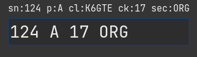

You can enter the serial number and precidence, or the year and section
as pairs. For instance ‘124A 17ORG‘. This would ensure the values get
parsed correctly.

You do not have to go back to correct typing. You can just tack the
correct items to the end of the field and the older values will get
overwritten. So if you entered ‘124A 17ORG Q‘, the precidence will
change from A to Q. If you need to change the serial number you must
append the precidence to it, ‘125A‘.

If the callsign was entered wrong in the callsign field, you can put the
correct callsign some where in the exchange. As long as it shows up in
the parsed label above correctly your good.

The best thing you can do is play around with it to see how it behaves.

==== The Exchange

In the ‘Sent Exchange‘ field of the New Contest dialog put in the
Precidence, Call, Check and Section. Example: ‘A K6GTE 17 ORG‘.

For the Run Exchange macro I’d put:

....
{HISCALL} {SENTNR} {EXCH}
....

=== ARRL 10M

The most confusing part of ARRL 10m is apparently how to setup your
exchange.

==== If you’re exchange is (RST {plus} Serial No.)

You should edit your exchange macro keys to be:

....
{SNT} {SENTNR}
....

and a ++#++ character in the sent exchange field in the contest
definition.

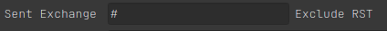

==== If you’re exchange is (RST {plus} State/Province/ITU)

You should edit your exchange macro keys to be:

....
{SNT} {EXCH}
....

and your state/prov/itu in the sent exchange field in the contest
definition.

=== RAEM

In the New/Edit Contest dialog, in the exchange field put just your Lat
and Lon. for me 33N117W. And in the exchange macro put ‘++#++
++{++EXCH}‘.

=== RandomGram

This plugin was submitted by @alduhoo. It reads a rg.txt file if it
exists in the user’s home directory to populate the next group in the
sent exchange field.

=== UKEI DX

For the Run exchange macro I’d put ’++{++SNT} ++#++ ++{++EXCH}’

=== CWO Open Contest

Note: when completing the "Recd Number and Name" field, place a space
between the received serial number and the name of the other operator.
eg. "123 Fred". (Advance on spacebar is disabled for this field.)
