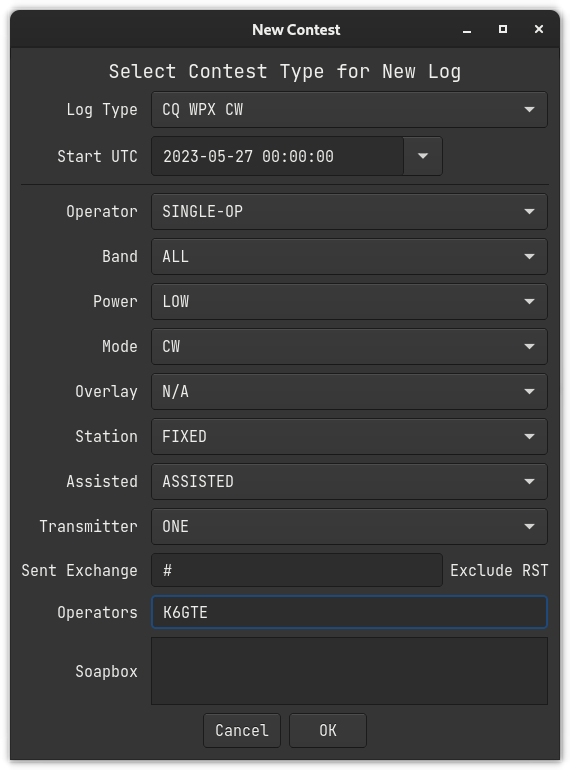
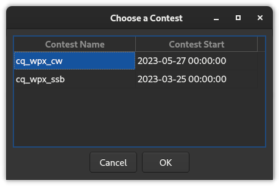

# Selecting a Contest

## Selecting a New Contest

Select *File ++>>++ New Contest*

## Selecting an Existing Contest as the Current Contest

Select *File ++>>++ Open Contest*

## Editing Existing Contest Parameters

Edit the parameters of a previously defined contest by selecting it as
the current contest. Then select *File ++>>++ Edit Current Contest*.
Click ‘OK‘ to save the new values and reload the contest. ‘Cancel‘ to
keep the existing parameters.
